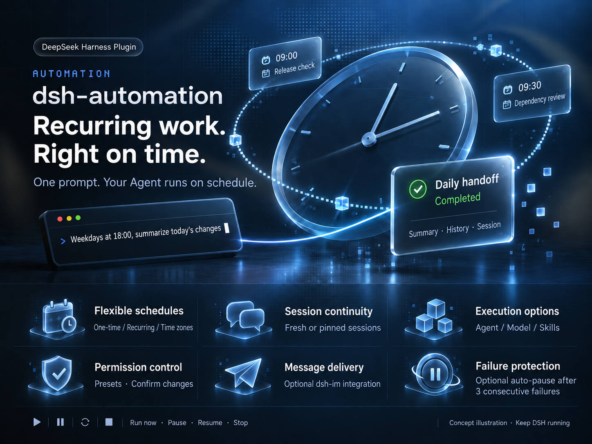

<p align="center">
  
</p>

<div align="center">

<p>
<strong>English</strong> · <a href="README.zh.md">简体中文</a>
</p>

<p>
<a href="https://www.npmjs.com/package/@alpacachen/dsh-automation"></a>
<a href="https://awesome-dsh-plugin.com"></a>
<a href="https://github.com/alpacachen/dsh-automation/actions/workflows/ci.yml"></a>
</p>

<p>
<a href="#get-started">Get started</a> &nbsp; / &nbsp; <a href="#demo">Demo</a> &nbsp; / &nbsp; <a href="docs/reference.md">Reference</a> &nbsp; / &nbsp; <a href="https://github.com/alpacachen/dsh-automation/issues">Report an issue</a>
</p>

<p>Release checks. Dependency reviews. Daily handoffs.<br>Set the schedule. Let your Agent take it from there.</p>

</div>

<table>
  <tr>
    <td width="33%" valign="top">
      <h3>🗓 Work on a schedule</h3>
      <p>One-time or recurring, across time zones.<br>Set dates, intervals, and limits visually.</p>
    </td>
    <td width="33%" valign="top">
      <h3>💬 Keep the conversation</h3>
      <p>Start fresh by default, or confirm<br>an existing session to keep its context.</p>
    </td>
    <td width="33%" valign="top">
      <h3>🧩 Choose the capabilities</h3>
      <p>Pick an Agent, model, and skills per task.<br>You set permissions and confirm changes.</p>
    </td>
  </tr>
  <tr>
    <td width="33%" valign="top">
      <h3>🔎 Follow every run</h3>
      <p>See summaries, duration, and errors.<br>Open past sessions to review the work.</p>
    </td>
    <td width="33%" valign="top">
      <h3>📨 Bring results to chat</h3>
      <p>Optionally deliver through <a href="https://github.com/xmanrui/dsh-im">dsh-im</a>.<br>Sidebar alerts for failures or every run.</p>
    </td>
    <td width="33%" valign="top">
      <h3>⏸ Stay in control</h3>
      <p>Run now, pause, resume, or stop.<br>Optionally auto-pause after 3 failures.</p>
    </td>
  </tr>
</table>

## Get started

Targets DSH **0.1.7-rc.2** and its current APIs. Older Host versions are not supported.

```sh
dsh plugin --profile web add @alpacachen/dsh-automation
```

Restart `dsh web`, open a workspace, and make your first request:

> Every weekday at 6 PM in Asia/Shanghai, summarize today's changes, next actions, and blockers. Read only; don't change files. Show me the configuration before creating it.

The Agent previews the schedule, permissions, and other settings. **It creates the task only after you confirm.** Or choose New automation in the sidebar and start from a built-in template.

Plans change: just say “Move the daily handoff to 7 PM.” To receive results in chat, select a bot and saved target under Edit → Message delivery. [Set up message delivery ↗](https://github.com/xmanrui/dsh-im/blob/main/PROACTIVE_DELIVERY.en.md)

> **Keep DSH running** for scheduled tasks. Runs have a 1-hour limit by default, and interactive approvals are never granted automatically. [How execution works →](docs/reference.md)

## Demo

Copy an example to your Agent and adjust the time or scope. **Every task requires a configuration preview and your confirmation before creation.** Fill in missing essentials, such as log paths, before saving the task.

<table>
  <tr>
    <td width="100%" valign="top">
      <h3>🌙 A handoff before you log off</h3>
      <p><sub>Recurring · Read only · Notify after each run</sub></p>
      <blockquote>Create a daily handoff for weekdays at 18:00 in Asia/Shanghai. Read today's commits and uncommitted workspace changes. Report completed work, next actions, and blockers with evidence; say so if nothing changed. Do not modify files. Notify me after each run.</blockquote>
    </td>
  </tr>
  <tr>
    <td width="100%" valign="top">
      <h3>🚀 A check before the release</h3>
      <p><sub>One-time · A verdict with evidence</sub></p>
      <blockquote>Create a one-time release check for tomorrow at 09:00 in Asia/Shanghai. Read the workspace's version configuration, release docs, and uncommitted changes. Report Ready or Blocked with evidence, and list anything not verified. Do not modify files or publish anything.</blockquote>
    </td>
  </tr>
  <tr>
    <td width="100%" valign="top">
      <h3>📦 A Monday dependency review</h3>
      <p><sub>Recurring · Choose models and skills</sub></p>
      <blockquote>Create a dependency review for Mondays at 09:30 in Asia/Shanghai. First list the available models and skills for me to choose. Inspect manifests and lockfiles, consult accessible official release notes, and report upgrade priorities, compatibility risks, and sources. Do not install or upgrade anything.</blockquote>
    </td>
  </tr>
  <tr>
    <td width="100%" valign="top">
      <h3>💬 Keep an investigation moving</h3>
      <p><sub>Pinned session · Retain context</sub></p>
      <blockquote>Create an investigation follow-up for weekdays at 10:00 in Asia/Shanghai, pinned to our investigation session in this workspace. Show me the target session for confirmation first. Read the logs I specify, build on our existing conclusions, and report new evidence and next steps. Do not repeat the entire history or modify files.</blockquote>
    </td>
  </tr>
  <tr>
    <td width="100%" valign="top">
      <h3>📨 A weekly report delivered to chat</h3>
      <p><sub>Recurring · Optional dsh-im delivery</sub></p>
      <blockquote>Create a weekly report for Fridays at 17:00 in Asia/Shanghai. Read this week's workspace commits and project docs. Produce a short chat-ready briefing: completed work, unresolved issues, and suggested next steps. Do not modify files or invent progress; flag missing evidence.</blockquote>
    </td>
  </tr>
  <tr>
    <td width="100%" valign="top">
      <h3>📝 Keep project docs up to date</h3>
      <p><sub>Recurring · Controlled file changes</sub></p>
      <blockquote>Create a docs-maintenance task for the first day of each month at 10:00 in Asia/Shanghai. Check README commands against the current package.json and update only outdated command instructions. Do not change application code, commit, or push. Let me confirm the model, skills, and workspace-write permissions before creation. Summarize the edits after each run.</blockquote>
    </td>
  </tr>
</table>

Dependency reviews need working web tools on the Host. For report delivery, configure dsh-im on the same Host, then select and confirm a bot and saved target under Edit → Message delivery; creating the task alone does not enable delivery. Docs maintenance requires write permissions.

---

<p align="center">
  <a href="docs/reference.md">Execution rules &amp; tool reference</a> &nbsp; · &nbsp;
  <a href="https://github.com/alpacachen/dsh-automation/issues">Feedback &amp; ideas</a> &nbsp; · &nbsp;
  <a href="LICENSE">MIT License</a>
</p>
