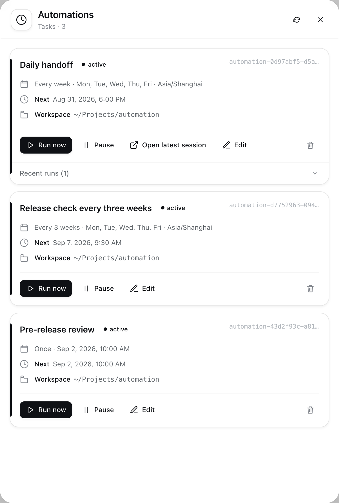
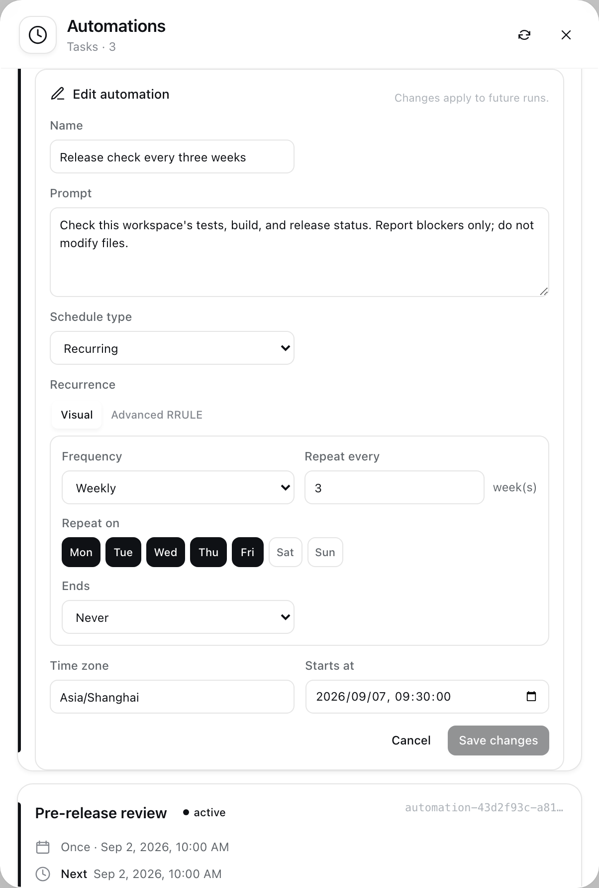

<div align="center">

# dsh-automation

### 在 DSH 里，用一句话安排未来的 Agent 工作。

支持单次与周期任务。每次运行都会创建一个全新、可见的 DSH 会话。

[](https://www.npmjs.com/package/@alpacachen/dsh-automation)

[](https://github.com/alpacachen/dsh-automation/actions/workflows/ci.yml)


**简体中文** · [English](README.md)

</div>

## ✨ 核心能力

- 🗣️ **自然语言创建**：告诉 Agent 做什么、什么时候做。
- 🗓️ **可靠调度**：支持单次时间、RFC 5545 周期规则和 IANA 时区。
- 🧼 **独立会话**：每次运行都是新会话，不携带之前的聊天历史。
- 👀 **过程可见**：状态、错误、运行历史和会话入口集中展示。
- 🎛️ **随时管理**：编辑、立即运行、暂停、恢复或删除任务。

## 🚀 快速开始

### 1. 安装

```sh
dsh plugin --profile web add @alpacachen/dsh-automation
```

### 2. 重启 DSH

重启 `dsh web`，让插件完成加载。

### 3. 让 Agent 创建任务

> 明天上午 9 点（Asia/Shanghai）检查这个工作区是否还有发布阻塞，并创建一个单次自动化。

或者：

> 每个工作日下午 6 点整理今天的改动和待办。只报告，不要修改文件。

创建后，在侧边栏打开 **「自动化任务」** 即可管理。

## 🎛️ 管理与编辑

任务卡支持：

- 修改名称、执行提示词和计划；
- 立即运行、暂停、恢复或恢复并运行；
- 打开最近会话和历史运行；
- 删除未来计划，同时保留已有会话。



### 可视化周期编辑器

常用周期无需手写 RRULE：

| 设置 | 实际含义 |
| --- | --- |
| 每天 · 每隔 `1` 天 | 每天执行 |
| 每周 · 每隔 `3` 周 · 周一至周五 | 每 3 周进入一次执行周，并在该周的周一至周五执行 |
| 每月 · 每隔 `2` 个月 · 15 日 | 每 2 个月的 15 日执行 |

还可以设置运行次数或结束日期。特殊规则可切换到 **「高级 RRULE」** 模式。



## ⏱️ 运行方式

```text
计划到期 → 进入全局队列 → 创建新会话 → Agent 执行 → 记录结果与会话入口
```

- 所有自动化全局串行执行，不会互相重叠。
- DSH 必须在计划到期时运行；重启后只补跑最近错过的一次。
- 暂停期间的周期会被跳过；「恢复并运行」不会改变原计划。

## 🗓️ 调度格式

| 类型 | 参数 | 示例 |
| --- | --- | --- |
| 单次 | `once_at` | `2026-09-01T01:00:00.000Z` |
| 周期 | `rrule` + `time_zone` + `start_at` | `FREQ=WEEKLY;BYDAY=MO,WE,FR` |

- `once_at` 使用 RFC 3339 UTC 时间。
- `rrule` 使用 RFC 5545 单行规则，不包含 `DTSTART`。
- `time_zone` 使用 IANA 时区，例如 `Asia/Shanghai`。
- `start_at` 使用本地时间格式 `YYYY-MM-DDTHH:mm:ss`。

## 🧰 Agent 工具

| 工具 | 用途 |
| --- | --- |
| `automation_create` | 创建单次或周期任务 |
| `automation_update` | 修改名称、提示词或计划 |
| `automation_list` | 查看任务与运行状态 |
| `automation_pause` | 暂停未来调度 |
| `automation_resume` | 恢复任务，可选择立即运行一次 |
| `automation_delete` | 删除任务并取消未来调度 |

## 💡 可以直接这样说

> 「每周一上午 9:30 检查依赖是否有重要更新。」

> 「把发布检查改到周五下午 4 点。」

> 「恢复每日交接，并立即额外运行一次。」

> 「列出所有自动化，并暂停依赖检查。」

## 开源许可

MIT
