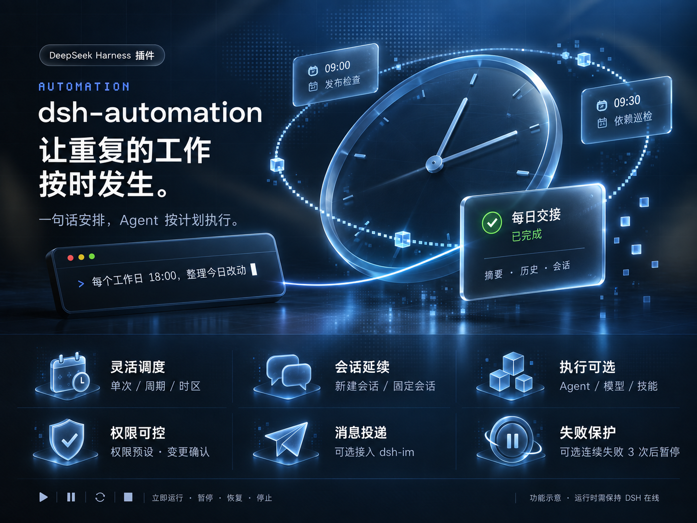

# 谢谢，再见

> **维护状态：停止积极维护（2026-10-08）**
>
> 本项目不再主动开发新功能，也不承诺后续 DSH 版本的兼容适配或问题修复。现有代码、文档和已发布版本保留，供已有用户参考与使用。

Automation 的起点很简单：让 Agent 不必每次等我们打开对话，而是能按约定的时间接手工作。从定时任务到会话延续、执行记录和消息投递，这个项目承载了不少尝试，也收到了许多帮助。

如今 DSH 已提供官方的定时任务能力。它与本插件并非完全等价，但对于基础调度，我更愿意把接力棒交给官方，而不再持续维护一套平行实现。**建议新用户优先了解所在 DSH 版本的官方 Schedule / 定时任务功能。**

感谢每一位使用、反馈、提 Issue、贡献代码和帮助验证的朋友。这个项目的意义，不只在于留下了多少功能，也在于我们一起探索过 Agent 可以怎样参与日常工作。

**给已有用户：**

- 停止维护不代表现有安装会立即失效，但后续升级 DSH 可能导致不兼容；请自行验证，不要将未经验证的版本用于关键无人值守任务。
- 本插件的任务、权限、模型与技能配置、执行历史以及 dsh-im 投递设置，**不会自动迁移到官方功能**；官方也不保证覆盖这些能力。
- 迁移前请备份任务配置和运行数据，逐项核对官方功能支持范围，先验证替代任务，再停用旧任务，避免重复执行。不要在备份前卸载或删除数据。
- 本仓库此次仅更新维护声明，不归档仓库、不弃用 npm 包、不删除代码，也不会更改你的现有任务。欢迎依据 MIT 许可证 fork，继续适合自己的方向。

下面保留原有介绍与使用文档，作为现有版本的参考，不代表继续维护的承诺。

谢谢你们，让这个小项目走到了这里。

---

<p align="center">
  
</p>

<div align="center">

<p>
<strong>简体中文</strong> · <a href="README.md">English</a>
</p>

<p>
<a href="https://www.npmjs.com/package/@alpacachen/dsh-automation"></a>
<a href="https://awesome-dsh-plugin.com"></a>
<a href="https://github.com/alpacachen/dsh-automation/actions/workflows/ci.yml"></a>
</p>

<p>
<a href="#开始使用">开始使用</a> &nbsp; / &nbsp; <a href="#demo">Demo</a> &nbsp; / &nbsp; <a href="docs/reference.zh.md">使用参考</a> &nbsp; / &nbsp; <a href="https://github.com/alpacachen/dsh-automation/issues">反馈问题</a>
</p>

<p>发布检查、依赖巡检、每日交接。<br>安排一次，让 Agent 按计划接手。</p>

</div>

<table>
  <tr>
    <td width="33%" valign="top">
      <h3>🗓 按时开工</h3>
      <p>单次或周期，跨时区安排。<br>日期、间隔和次数，可视化设置。</p>
    </td>
    <td width="33%" valign="top">
      <h3>💬 接着上次聊</h3>
      <p>默认新建会话，也可确认绑定<br>已有对话，延续工作区上下文。</p>
    </td>
    <td width="33%" valign="top">
      <h3>🧩 配好再出发</h3>
      <p>Agent、模型、技能按任务选择。<br>权限由你设定，变更需确认。</p>
    </td>
  </tr>
  <tr>
    <td width="33%" valign="top">
      <h3>🔎 每次都有据可查</h3>
      <p>摘要、耗时、错误一眼查看。<br>打开历史会话，回看执行过程。</p>
    </td>
    <td width="33%" valign="top">
      <h3>📨 结果送到你手边</h3>
      <p>可选接入 <a href="https://github.com/xmanrui/dsh-im">dsh-im</a>，投递到聊天工具。<br>侧边栏通知可选仅失败或每次完成。</p>
    </td>
    <td width="33%" valign="top">
      <h3>⏸ 随时接手</h3>
      <p>立即运行、暂停、恢复或停止。<br>可选连续失败 3 次后自动暂停。</p>
    </td>
  </tr>
</table>

## 开始使用

以 DSH **0.1.7-rc.2** 及其当前接口为基线，不再支持旧版 Host。

```sh
dsh plugin --profile web add @alpacachen/dsh-automation
```

重启 `dsh web`，在工作区里发出第一条安排：

> 每个工作日 18:00（Asia/Shanghai）整理今天的改动、待办和阻塞项。只读，不改文件。创建前先让我确认配置。

Agent 会预览计划、权限等配置，**你确认后才创建**。也可以在侧边栏「自动化任务」点「新建自动化」，从内置模板开始。

计划有变，继续说「把每日交接改到晚上 7 点」；想发到聊天工具，在「编辑 → 消息投递」选好机器人和已保存目标即可。[设置消息投递 ↗](https://github.com/xmanrui/dsh-im/blob/main/PROACTIVE_DELIVERY.md)

> **保持 DSH 在线**，任务才能按计划执行。每次运行默认最多 1 小时，交互批准不会自动通过。[了解运行规则 →](docs/reference.zh.md)

## Demo

复制一个例子给 Agent，按需改时间和范围。**所有任务都先预览配置、经你确认后创建**；没有明确指定的日志路径或其他必要信息，先补齐再创建。

<table>
  <tr>
    <td width="100%" valign="top">
      <h3>🌙 下班前，交接已经写好</h3>
      <p><sub>周期任务 · 只读 · 每次完成通知</sub></p>
      <blockquote>创建一个每个工作日 18:00（Asia/Shanghai）的每日交接任务。只读检查工作区当天的提交和未提交改动，输出已完成、待办、阻塞项，并注明依据；没有改动就如实说明。每次完成后通知我。</blockquote>
    </td>
  </tr>
  <tr>
    <td width="100%" valign="top">
      <h3>🚀 发布前，先过一遍清单</h3>
      <p><sub>单次任务 · 有结论、有依据</sub></p>
      <blockquote>创建一个明天 09:00（Asia/Shanghai）执行一次的发布检查。只读检查当前工作区的版本配置、发布文档和未提交改动，给出“可发布”或“存在阻塞”及依据；未验证的项单列，不要替我发布。</blockquote>
    </td>
  </tr>
  <tr>
    <td width="100%" valign="top">
      <h3>📦 周一，看看依赖该不该动</h3>
      <p><sub>周期任务 · 模型 / 技能选择</sub></p>
      <blockquote>创建一个每周一 09:30（Asia/Shanghai）的依赖巡检任务。先列出当前可用模型和技能供我选择。运行时检查依赖清单与锁文件，结合可访问的官方更新说明给出升级优先级、兼容风险和来源；只报告，不安装或升级。</blockquote>
    </td>
  </tr>
  <tr>
    <td width="100%" valign="top">
      <h3>💬 排障有后续，接着原来的线索查</h3>
      <p><sub>固定会话 · 延续上下文</sub></p>
      <blockquote>创建一个每个工作日 10:00（Asia/Shanghai）的排障跟进任务，绑定当前工作区中我们这次排障的会话。先展示目标会话让我确认。每次只读检查我指定的日志，结合已有结论列出新增证据和下一步，不重复输出整段历史。</blockquote>
    </td>
  </tr>
  <tr>
    <td width="100%" valign="top">
      <h3>📨 周五，把周报送到聊天工具</h3>
      <p><sub>周期任务 · 可选 dsh-im 投递</sub></p>
      <blockquote>创建一个每周五 17:00（Asia/Shanghai）的周报任务。只读整理工作区本周的提交和项目文档，输出适合发到聊天工具的简报：本周完成、遗留问题、下周建议。不要编造进展，缺少依据时明确说明。</blockquote>
    </td>
  </tr>
  <tr>
    <td width="100%" valign="top">
      <h3>📝 每月，让项目文档跟上代码</h3>
      <p><sub>周期任务 · 受控文件修改</sub></p>
      <blockquote>创建一个每月 1 日 10:00（Asia/Shanghai）的文档维护任务。核对 README 与当前 package.json 的命令，只更新 README 中已过时的命令说明，不改业务代码、不提交、不推送。创建前让我确认模型、技能及允许写入工作区的权限；完成后给出修改摘要。</blockquote>
    </td>
  </tr>
</table>

依赖巡检需要 Host 上有可用的联网工具。周报推送需先配置同 Host 的 dsh-im，再在任务的「编辑 → 消息投递」选择机器人和已保存目标并确认；创建任务本身不会开启投递。文档维护需要允许写入的权限。

---

<p align="center">
  <a href="docs/reference.zh.md">运行规则与工具参考</a> &nbsp; · &nbsp;
  <a href="https://github.com/alpacachen/dsh-automation/issues">问题与建议</a> &nbsp; · &nbsp;
  <a href="LICENSE">MIT License</a>
</p>
